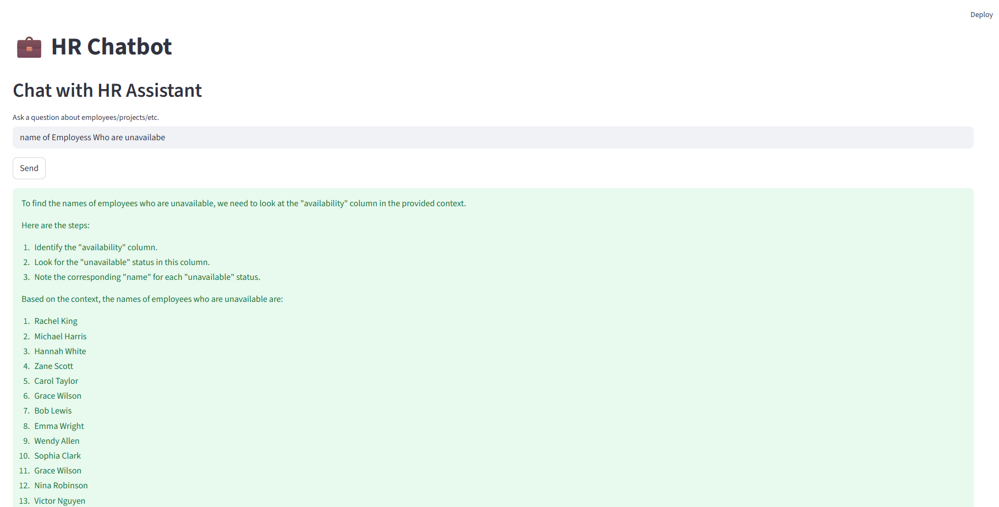

# HR Resource Query Chatbot

## Overview
This project is an AI-powered HR chatbot designed to help users query employee information, skills, projects, and availability. It combines a **FastAPI backend** for handling queries and a **Streamlit frontend** for a user-friendly interface. The system uses **LangChain**, **Ollama**, and **Groq** LLMs to provide retrieval-augmented generation (RAG) answers based on structured Excel data.

## Project Structure

### 1. `app_sql` Directory
This directory contains the core files for building and running a Retrieval-Augmented Generation (RAG) system over an SQL database:

- **`rag_sql.ipynb`**  
  Jupyter Notebook for testing and running the RAG pipeline on the SQL database.

- **`app.py`**  
  Contains the backend implementation of the RAG model using **FastAPI**.

- **`ui.py`**  
  Streamlit-based web application that consumes the API from `app.py` for the frontend interface.

---

### 2. `faiss_index` Directory
Stores the **vector database encodings** used by the RAG system for efficient similarity search.

---

### 3. `rag_excel.ipynb`
Jupyter Notebook for testing and running the RAG pipeline on **Excel** data sources.

---

### 4. `ui.py` (Excel Version)
Streamlit-based web application for the **RAG over Excel** model using:
- **Ollama embeddings**
- **FastAPI backend**
- **Streamlit frontend**


## Features
- Ask natural language questions about employees and projects.
- Search employees by skill with live results.
- RAG-based answers using LLMs over HR Excel data.
- Streamlit interface with sidebar search and chat functionality.
- FastAPI backend exposing `/chat` and `/employees/search` endpoints.

## Architecture
**System Design:**
1. **Data Layer:** Employee data stored in Excel, loaded using `UnstructuredExcelLoader`.
2. **Vectorization:** Text split into chunks and embedded using `OllamaEmbeddings`.
3. **Vectorstore:** FAISS used to store embeddings for fast similarity search.
4. **LLM Layer:** `OllamaLLM` and `ChatGroq` provide step-by-step reasoning for QA.
5. **QA Chain:** Retrieval chain built using LangChain combining document retrieval with LLM reasoning.
6. **API Layer:** FastAPI exposes endpoints for chat and skill-based employee search.
7. **Frontend:** Streamlit UI communicates with FastAPI for real-time responses.

**Architecture Diagram (Conceptual):**
Excel Data → LangChain Loaders → Text Split & Embed → FAISS Vectorstore → LLM QA Chain → FastAPI → Streamlit UI


## Setup & Installation
1. Clone the repository:
```bash
git clone <repo_url>
cd hr-chatbot
```

## API Documentation

#### POST /chat

Description: Ask a natural language question about employees/projects.
Request Body:

{
  "query": "Which employees have Python skills?"
}

Response:

{
  "answer": "Employee X, Employee Y have Python experience."
}

#### GET /employees/search

Description: Search employees by skill.
Query Parameters:

skill (string, required): Skill to search for

Example Request:

/employees/search?skill=Python


Response:

{
  "results": [
    "Employee X: Skills: Python, SQL",
    "Employee Y: Skills: Python, JavaScript"
  ]
}



